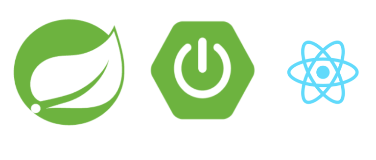
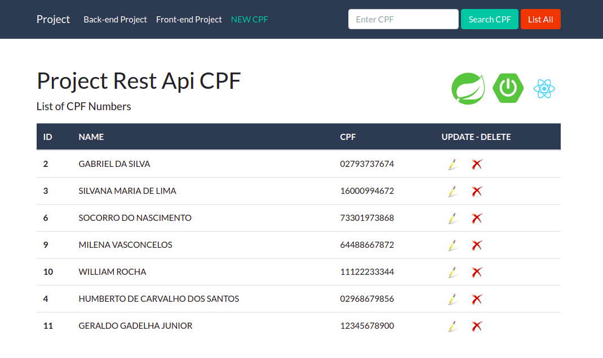

  

# React Application

Developed by 

If you want, read the reference documentation about [React](https://reactjs.org/docs/getting-started.html).

## About the application

This repository contains an example application using the React with [Hooks](https://reactjs.org/docs/hooks-intro.html). 

The purpose of the application is:
* Consuming REST APIs making HTTP requests using methods with [Axios](https://github.com/axios/axios).
* The methods used were: get, post, put and delete.
* It was used the Postgres database instance in [AWS](https://aws.amazon.com/). 
* This appliction React run embedded inside the docker container.

## Developed With

* **React Js**: JavaScript library for building user interfaces.
* **React Hooks**: Functions that let us hook into the React state and lifecycle features from "function components".
* **Axios**: Javascript library used to make HTTP requests from the browser that also supports the ES6 Promise API.
* **Bootstrap**: CSS framework directed at responsive, mobile-first front-end web development.
* **Docker** to package and run applications inside a container.
* **Vs Code** as IDE.

## Database table

The table contains three fields as follow:
  * ID: sequential number that will be the primary key in the database.
  * NAME: 50 characters.
  * CPF: 11 characters.

## How to develop
* You have install [Node Js](https://nodejs.org/pt-br/download/).
* Clone the git repository using the URL on the Github home page:

		`$ git clone git@github.com:ralexandre11/app-react-cpf.git`

* To run:

		`$ npm start`

## How to run application using Docker
* If you don't have Docker, please install Docker:
[Docker Desktop](https://docs.docker.com/get-docker/) or [Docker basics for Amazon ECS](https://docs.aws.amazon.com/AmazonECS/latest/userguide/docker-basics.html).

* To build the image:

		`docker -D build -f Dockerfile -t projetquebec/app-react .`

* To run using docker:

		`docker run -it --rm -p 3000:80 projetquebec/app-react`

## dockerhub
https://hub.docker.com/repository/docker/projetquebec/app-react
